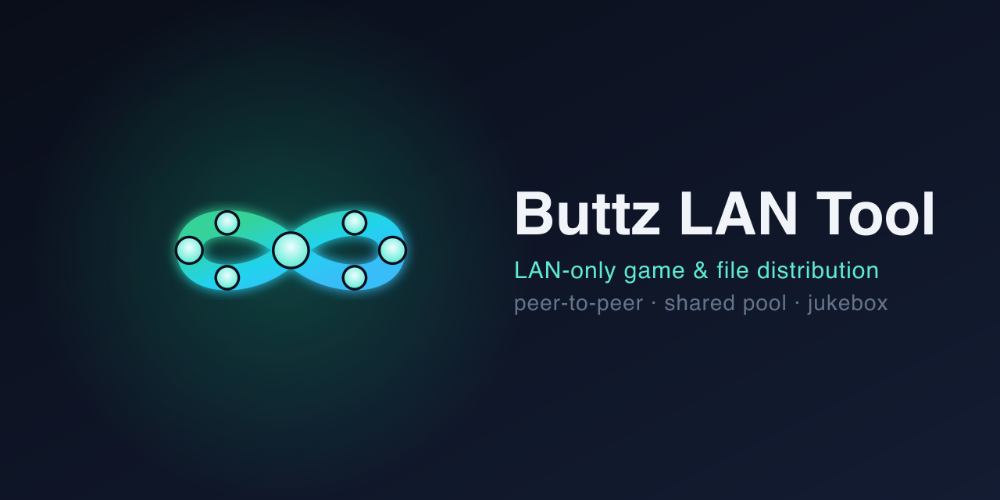
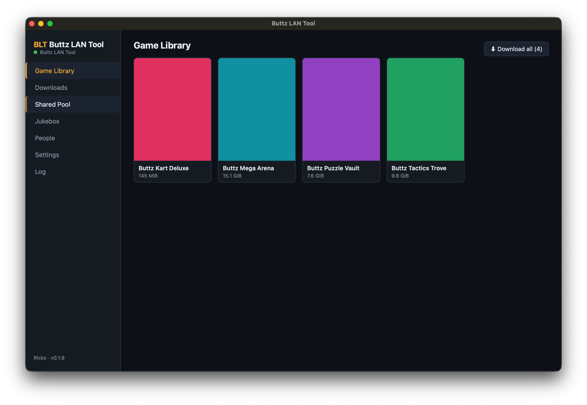
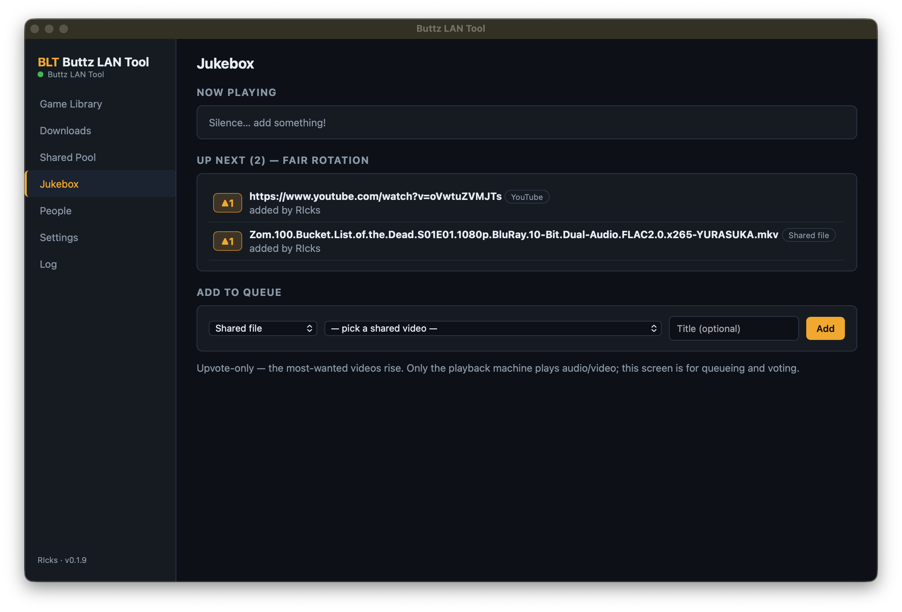
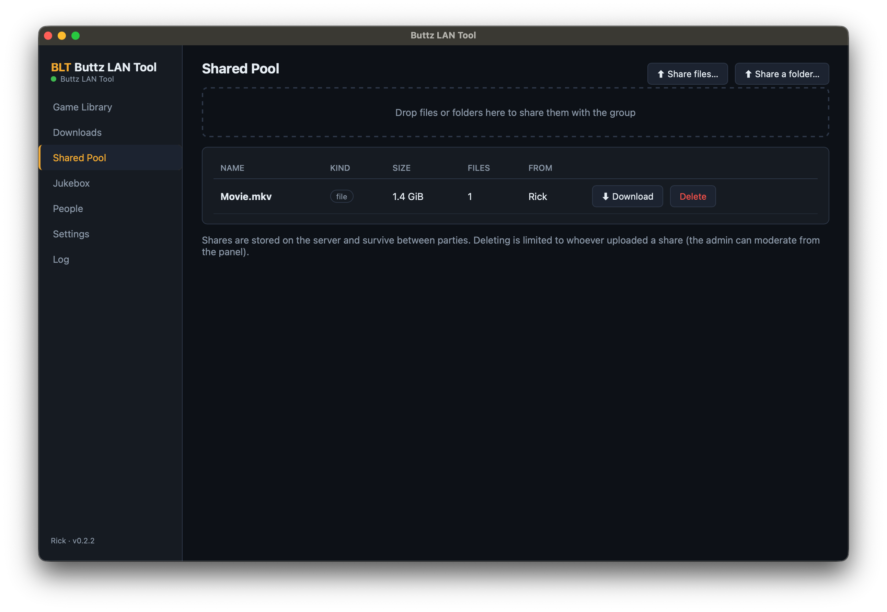
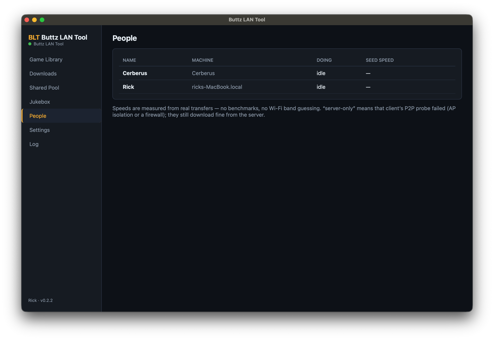
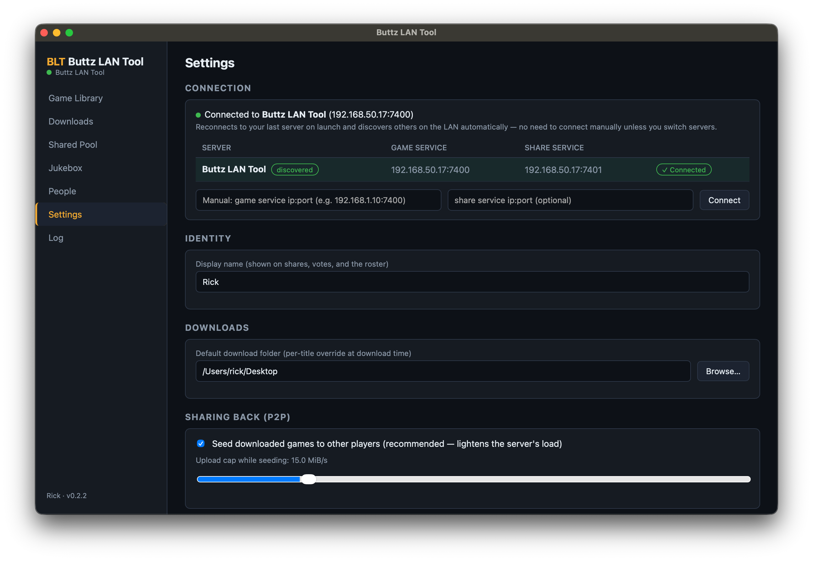
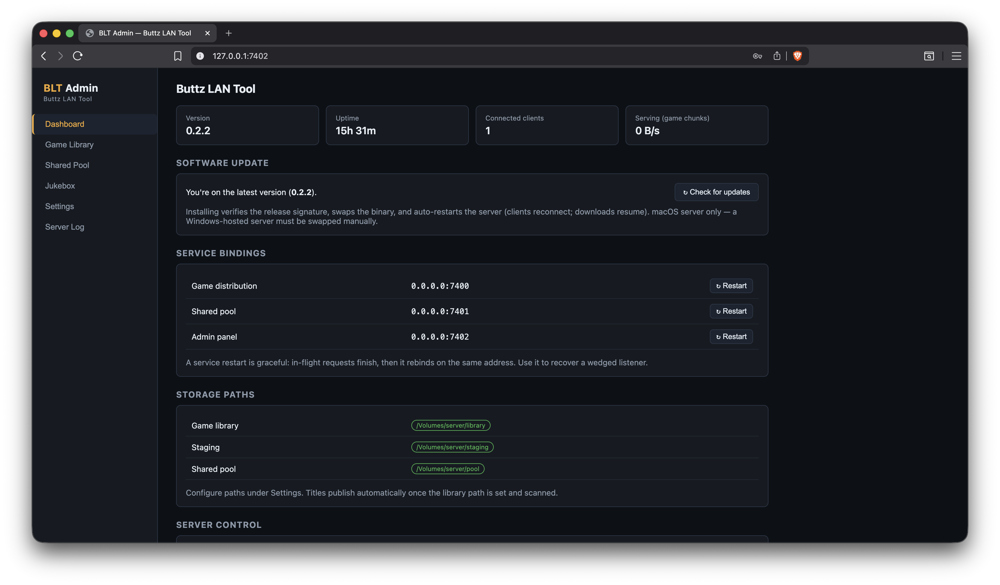

<p align="center">
  
</p>

<h1 align="center">Buttz LAN Tool (BLT)</h1>

<p align="center">
  Self-hosted, LAN-only game distribution, file sharing, and a networked video
  jukebox for a LAN party among trusted friends. Windows and macOS.
</p>

<p align="center">
  
  
  
</p>

BLT is two binaries that turn a spare box and everyone's laptops into a private
LAN-party stack:

- **`blt-server`** is a headless Rust server (Axum) that hosts the game library,
  the shared file pool, and the jukebox state, plus a password-gated web admin
  panel. It runs on the dedicated, multi-NIC host.
- **The Buttz LAN Tool desktop app** is a Tauri app that runs as a **client**
  (players) or as a **playback machine** (the box wired to the TV).

The core runs entirely on your LAN, with no BLT cloud, no account, and no
telemetry. The only outbound connections are optional and explicit: the manual
update check against GitHub Releases (you choose when to download), and YouTube
or streaming-service playback when someone queues it in the jukebox. With those
two features unused, BLT works fully offline.

## Features

### Game distribution

- Unzipped, folder-per-title library, scanned into 4 MiB BLAKE3 chunk manifests.
- Chunked downloads with pause, resume, and retry across Wi-Fi drops.
- Every chunk is BLAKE3-verified before it touches disk, so a bad source can
  never corrupt a title.
- Peer-accelerated: clients seed what they have at a configurable cap, and the
  scheduler blends the server and peers by measured throughput.
- Quick validation (presence and size) plus deep verify (full re-hash) with
  per-chunk repair.
- Optional per-title metadata (cover art, name, year, genre, blurb, launch
  options) via a `.blt/` sidecar, with a graceful fallback when it is absent.
- Optional Windows post-install scripts that are shown and confirmed before they
  run, never auto-executed.

### Shared file pool

- Drag and drop files or whole folders to share them with the group.
- Structure-preserving downloads with an "X of N files" completeness check.
- Path names are sanitized on the writing side, so a folder authored on one OS
  lands safely on another.
- Persistent between parties and attributed by display name.

### Jukebox

- Upvote-only shared queue, so the most-wanted videos rise to the top.
- Fair-rotation or vote-ranked ordering.
- The playback machine auto-advances the queue: YouTube plays embedded,
  shared-pool and direct-URL videos play through [mpv](https://mpv.io), and DRM
  services (Netflix, Hulu, Prime) open in the real browser and wait for a human
  to press Next.
- Only the playback machine renders audio and video. Every other screen is for
  queueing and voting.

### Presence and routing

- Live roster of who is online, what they are doing, and their measured seed
  speed.
- Reachability self-test with a graceful server-only fallback when AP isolation
  or a firewall blocks peer traffic.
- Throughput-weighted scheduling that is band-agnostic: slow peers simply
  measure slower, no benchmarks required.

### Server and admin

- Three independently bindable services (game, share, admin) that can split
  across up to three NICs.
- Password-gated web admin panel for library management, service rebinds,
  storage paths, jukebox moderation, and the live server log.
- Signed self-update for the desktop app over GitHub Releases, always manual and
  never automatic.
- SQLite on both sides, running in WAL mode with periodic backups on the server.

## Screenshots

|  |  |
|:---:|:---:|
| **Game library** | **Jukebox** |
|  |  |
| **Shared pool** | **People (live roster)** |
|  |  |
| **Client settings** | **Web admin panel** |
|  |  |

## Footprint

BLT is built to disappear into the background. It should never be the reason a
machine chugs mid-party.

- **Native, not Electron.** The desktop app is Tauri 2, a small Rust binary
  driving the OS's built-in WebView (WKWebView or WebView2), so there is no
  bundled Chromium. The server and shared `core` are pure Rust: native code, no
  VM, no garbage collector, and one embedded SQLite (no separate database
  process).
- **Idle means idle.** State is pushed over the live WebSocket channel rather
  than polled, so a client sitting in the lobby uses essentially no CPU.
- **No transcoding.** Playback hands video to the native WebView or to mpv. BLT
  never re-encodes, so the TV box stays cool.
- **Works only when working.** The one real cost is BLAKE3 hashing during a
  transfer, which is SIMD-fast and only runs while a download or seed is active.
  Otherwise the server is I/O-bound, just serving and verifying chunks.

In practice the Rust processes idle at a few tens of MB of RAM and near-zero CPU,
scaling up only with active transfers.

## Build from source

Prereqs: Rust (stable) and Node 22 or newer.

```sh
cargo test                                   # core + server suites (incl. integration)
cargo build --release -p blt-server          # the server binary

cd admin-web && npm install && npm run build # admin SPA (served by the server)
cd apps/desktop && npm install && npm run tauri build   # desktop bundles (DMG / NSIS)
```

Dev loops: `cargo run -p blt-server`, then `cd admin-web && npm run dev` (proxies
to `127.0.0.1:7402`), and `cd apps/desktop && npm run tauri dev`.

## Server setup (the host)

1. Run `blt-server`. Data lands in `%LOCALAPPDATA%\BLT\server` on Windows or
   `~/Library/Application Support/BLT/server` on macOS; override with
   `--data-root`.
2. Open the admin panel at `http://<server>:7402`, set the admin password on
   first run, then under **Settings**:
   - **Library path**: each subfolder is one game, stored unzipped.
   - **Staging path**: same volume as the library. Copy new games here and they
     auto-promote once files stop changing (about 30 seconds).
   - **Share path**: the shared-pool drive.
   - Bind each service to the NIC you want. Game, share, and admin can split
     across up to three.
3. Click **Scan now** (or wait for the auto-scan). Published titles appear in
   clients immediately.
4. Optional per-title metadata: a `.blt/` folder inside the game with an
   `info.json` (name, year, genre, players, blurb, `launch` entries, Windows
   `install_script`) and a `cover.png` or `cover.jpg`. Editing it never
   re-versions the game files.

Locked out of the admin panel by a bad bind? Edit `config.toml` in the server
data folder and restart, or run `blt-server --reset-admin-bind`.

## Client setup (players)

On first launch, pick **Player**, set your display name (it defaults to the
computer name), and choose a download folder. The server is discovered over
mDNS; if discovery is blocked, type the game-service `ip:port` manually under
Settings then Connection.

Downloads are chunked, BLAKE3-verified, resumable across Wi-Fi drops, and
peer-accelerated. You seed what you have already downloaded at a capped rate,
which you can toggle and cap under Settings.

## Playback machine (the TV box)

On first launch, pick **Playback machine**, or lock an existing client via
Settings then Playback lockdown (entering and exiting both require the admin
password). It plays the jukebox queue with auto-advance: YouTube plays embedded,
shared-pool and direct-URL videos play through mpv, and Netflix, Hulu, or Prime
items open in the real browser and wait for a human to press Next.

> **Install mpv on the playback machine** (`brew install mpv` or
> `winget install mpv`) for broad codec support, including HEVC and 10-bit, MKV,
> and FLAC or DTS. Without it, local videos fall back to the webview's built-in
> player, which only handles browser-native formats. mpv is only needed on the
> playback box. Log into the streaming services in that browser before the party.

## Pre-party network checklist

- Allow the apps through the OS firewall on first launch. On Windows, set the
  network profile to **Private**. If denied, discovery and transfers fail
  silently.
- Confirm AP and client isolation is off by having two laptops ping each other.
  If isolation is on, clients fall back to server-only downloads (visible in the
  People roster), which still works.
- Prefer copy tools that preserve timestamps when updating the library, since
  change detection uses size and mtime.

## Releases and updates

Tagged releases build signed bundles via CI (`.github/workflows/release.yml`);
the Ed25519 private key lives only in CI secrets. Updates are manual: the app
indicates an update and you choose "Download & restart". Nothing ever
auto-installs, and a locked playback box is never restarted mid-party.

macOS bundles are un-notarized for now, so the first launch is right-click then
Open.
